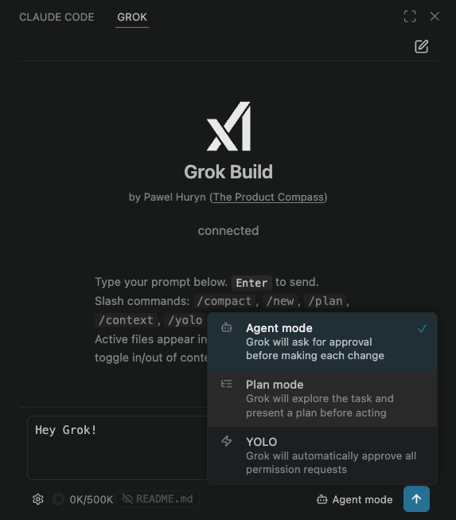
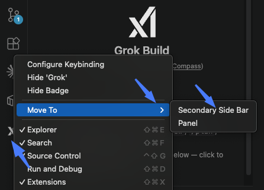
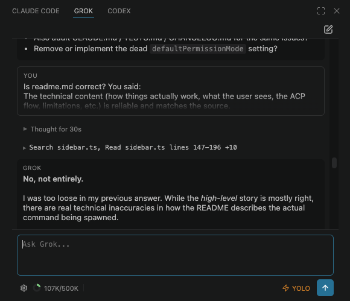
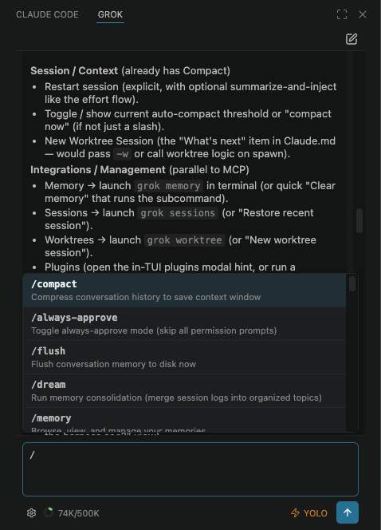

# Grok Build for VS Code

[](LICENSE) [](https://code.visualstudio.com) [](https://x.ai) [](https://www.productcompass.pm)

Native VS Code sidebar for **xAI's Grok Build** CLI, driven by `grok agent stdio` over the [Agent Client Protocol (ACP)](https://agentclientprotocol.com).

xAI's docs list Zed, Neovim, Emacs, and marimo as ACP-compatible. This extension fills the VS Code gap.

Not affiliated with xAI.



---

<details>
<summary><strong>Platform support</strong></summary>

**macOS and Linux only.** The `grok` CLI does not have a Windows build. On Windows, use WSL2 with VS Code's Remote-WSL extension and install everything on the WSL side.

</details>

---

<details>
<summary><strong>Prerequisites</strong></summary>

Install the Grok CLI, then sign in:

```bash
curl -fsSL https://x.ai/cli/install.sh | bash
grok /login
```

`grok /login` opens a browser and completes OAuth in one step. That's the recommended path — no API key management needed.

**Alternative — API key:** if you prefer a key over OAuth, get one at [console.x.ai](https://console.x.ai), then set it before starting VS Code:

```bash
export XAI_API_KEY=xai-...
```

Or add it to `.env` in your workspace root — the extension loads it automatically and maps it to the key name the CLI expects.

> **Note:** setting `XAI_API_KEY` takes precedence over your `grok /login` session. With a subscription (login only), the model picker shows **Grok Build**. With an API key you also get access to **grok-4.20** (3 variants), **grok-4.3**, and **grok-imagine** (3 options).

</details>

---

<details>
<summary><strong>Install</strong></summary>

**Quick install (no build required):**

Download the latest VSIX from [`releases/`](releases/) and install it:

```bash
code --install-extension releases/grok-vscode-phuryn-1.0.0.vsix
```

Or install from source — clone, build, and install in one step:

```bash
git clone https://github.com/phuryn/grok-build-vscode.git
cd grok-build-vscode
npm install
./scripts/install.sh   # macOS / Linux / WSL
```

Then reload VS Code (**Ctrl+Shift+P → Developer: Reload Window**) and click the Grok icon in the activity bar.

> **Tip — move to the secondary side bar:** Right-click the Grok icon in the activity bar → **Move To → Secondary Side Bar**. Grok then sits in the right panel alongside Claude Code, Copilot Chat, or other AI tools, leaving the left side bar free for Explorer and Source Control.
>
> 

**Uninstall:**

```bash
./scripts/uninstall.sh
# or
code --uninstall-extension PawelHuryn.grok-vscode-phuryn
```

</details>

---

<details>
<summary><strong>How a session starts</strong></summary>

When the panel opens (or you click **+** for a new session), the extension:

1. Locates the `grok` binary (`grok.cliPath` setting → `~/.grok/bin/grok` → PATH).
2. Spawns `grok agent stdio` as a background child process — **this is the process you'll see in Activity Monitor / `ps`**. It never opens a terminal window.
3. Sends `initialize` + `session/new` over stdin/stdout using the ACP JSON-RPC protocol.
4. If `grok.defaultEffort` is set, passes `--reasoning-effort <level>` as a flag to the spawn command.
5. Streams all subsequent activity (messages, tool calls, permission requests) back to the chat.

All session state, tool execution, MCP servers, subagents, memory, and plan-mode bookkeeping live inside that CLI process. The extension is a thin UI shell over ACP.

</details>

---

<details>
<summary><strong>Usage</strong></summary>

### Sending a prompt

Type in the composer and press **Enter** (or **Ctrl/Cmd+Enter** if you've enabled that in settings). The agent streams its response in the chat. Thinking traces appear as collapsible "Thought for Xs" blocks.

### Slash commands

Type `/` to open autocomplete. Commands are sourced live from the CLI via `available_commands_update` — the list reflects exactly what the running CLI version supports.

**Session & context**

| Command | Effect |
|---|---|
| `/compact` | Compress conversation history to free context |
| `/context` | Show context window usage and session stats |
| `/session-info` | Show current model, turns, and context usage |
| `/flush` | Flush conversation memory to disk |
| `/new` | Start a fresh session |

**Modes & behaviour**

| Command | Effect |
|---|---|
| `/plan` | Enter plan mode (draft plan before acting) |
| `/yolo` | Enable auto-approval for the session |
| `/always-approve` | Toggle always-approve (skip all permission prompts) |

**Memory**

| Command | Effect |
|---|---|
| `/memory` | Browse, view, and manage memories |
| `/dream` | Memory consolidation (merge session logs into organised topics) |

**Agents & coding**

| Command | Effect |
|---|---|
| `/implement` | Full implement → review → fix loop with subagent reviewers |
| `/review` | Review uncommitted changes, a branch, or a GitHub PR |
| `/pr-babysit` | Monitor PRs, fix CI failures, address review comments |
| `/check` | Verify changes with a subagent self-verification loop |
| `/design` | Design-doc writer + reviewer loop until consensus |
| `/best-of-n` | Run N parallel implementations and pick the best |
| `/loop` | Run a prompt on a recurring interval |

**Document & media skills**

| Command | Effect |
|---|---|
| `/docx` | Create, read, or edit Word documents |
| `/pptx` | Create or edit PowerPoint presentations |
| `/xlsx` | Work with spreadsheets (.xlsx / .csv) |
| `/imagine` | Generate an image from a text description |
| `/imagine-video` | Generate a video from a text description |

**System**

| Command | Effect |
|---|---|
| `/help` | Grok docs (config, MCP, auth, skills) |
| `/plugins` | List, reload, trust, add, or remove plugins |
| `/create-skill` | Create a new Grok skill |
| `/feedback` | Send feedback about the current session |

### Files in context (chips)

The active editor file is added as a chip automatically. Chips are sent to the agent as `@/path/to/file` references in the prompt — the path is resolved by the CLI, not embedded inline. This means file content stays up to date without being pasted into chat history.

- Click a chip to toggle it out of (or back into) the current prompt
- Drag files from the Explorer to add them; hold **Shift** to embed the content inline
- Right-click a file in the Explorer or editor title → **Grok: Send File**
- Select text, right-click → **Grok: Send Selection**
- **Alt+G** inserts an `@`-mention for the active file directly into the prompt

### Tool calls

When the agent reads files, runs shell commands, or edits code, each action appears in the chat:

- **Single call** — flat row with a human-readable label: "Read sidebar.ts lines 1–120", "Edit package.json", "Run npm test"
- **Multiple calls** — collapsed group header ("Read, Edit +2") that expands on click to show each call individually

Tool calls don't affect the conversation visible to the model — they're handled by the CLI process.

### Permission cards

Before the agent writes a file or runs a command, it asks for permission. A card appears in the chat with options:

| Option | Effect |
|---|---|
| **Allow always** | Adds a permanent allow rule for this tool + path combination |
| **Allow once** | Permits this single call |
| **Reject** | Blocks the call; the agent may try a different approach |

For file edits, click **open diff →** to preview the exact change in the VS Code diff editor before deciding.

### Mode

The mode button in the bottom toolbar opens a picker with three options:

| Mode | Behaviour |
|---|---|
| **Agent mode** | Normal mode — the agent acts and asks for permission when needed |
| **Plan mode** | ⚠️ Disabled — see note below |
| **YOLO** | Auto-approves every permission request; no cards shown. Handled entirely in the extension — the CLI process and its session are preserved, no restart |

Switching from YOLO back to Agent re-enables permission cards immediately.

> **Plan mode — current limitation:** Plan mode is disabled in the extension because the `x.ai/exit_plan_mode` ACP response path in the current CLI version does not support rejection or abandonment — any client response (result or error) is treated as approval. Enabling plan mode without working Reject/Abandon buttons would silently approve every plan. This will be re-enabled once the CLI wires up the external-client rejection code path.

**How modes map to ACP internally:**
- **Agent** → `session/set_mode: "agent"` sent to the CLI. The CLI asks for permission before each write or shell action.
- **Plan** → `session/set_mode: "plan"` sent to the CLI. The CLI collects a full plan and sends it back via `x.ai/exit_plan_mode`. *Not yet usable via ACP — see above.*
- **YOLO** → no ACP call; the extension simply auto-responds "allow always" to every incoming `session/request_permission` request. The session and CLI process are untouched.

### Reasoning Effort

Click the **gear** icon → *Reasoning Effort* to choose how deeply the model thinks before responding:

| Level | Behaviour |
|---|---|
| **CLI default** | No flag passed; the CLI decides |
| **Low** | Fast, lightweight reasoning |
| **Medium** | Balanced |
| **High** | Deeper reasoning |
| **XHigh** | Very deep |
| **Max** | Maximum depth, slowest |

Changing effort restarts the session (a new `grok agent stdio` process is spawned with the updated `--reasoning-effort` flag). The selected level is saved to `grok.defaultEffort` in VS Code settings and persists across reloads.

If the current session has chat history, a dialog appears with two options:
- **Summarize & Restart** — asks Grok to summarize the conversation, starts a fresh session, then automatically sends the summary as context so Grok can pick up where it left off.
- **Just Restart** — discards the current session immediately and clears the chat.

### Models

Click the **model name button** in the gear popover to pick from the models your subscription provides. The list comes from the CLI's `session/new` response — it reflects your account's available models. Switching model is live (`session/set_model`), no restart needed.

### Context usage

The donut in the bottom toolbar shows token usage as `usedK/maxK` (e.g. `74K/500K`). It updates after each prompt response.

When context fills up, type `/compact` to compress the conversation, or click **+** for a fresh session.

### Session restart

Click **+** (new session) to kill the current `grok agent stdio` process and spawn a fresh one. On restart:

- Mode resets to Agent
- Effort uses `grok.defaultEffort` (or CLI default if unset)
- Model uses `grok.defaultModel` (or CLI default if unset)
- Chat history is cleared; memory persisted by the CLI (in `~/.grok/`) is not affected

### Settings (gear popover)

Click the **gear** icon in the bottom toolbar to open the settings panel:

**Model and Effort**
- *Model name button* — opens the model picker
- *Reasoning Effort dots* — pick effort level (Low → Max)

**Session**
- *Compact conversation* — sends `/compact` to compress context without leaving the UI

**Config**
- *Open global config* — opens `~/.grok/config.toml` in the editor (created if missing). Add MCP servers, model defaults, and other CLI options here.
- *Open project config* — opens `.grok/config.toml` in the workspace root (created if missing). Workspace-scoped MCP servers and settings go here.
- *MCP servers* — runs `grok mcp list` in a VS Code terminal to show all configured MCP servers and their status.

**Debug**
- *Show extension logs* — reveals the "Grok" output channel, which logs every ACP message sent and received. Useful for diagnosing connection or permission issues.

### MCP servers

MCP servers are configured in the CLI, not in the extension. Add them to `~/.grok/config.toml` (global) or `.grok/config.toml` (project). The extension does not interfere — it passes no `mcpServers` field to `session/new`, so the CLI picks up its own configuration automatically.

Use the gear → *Open global config* shortcut to reach the file, then restart the session (**+**) for changes to take effect.

</details>

---

<details>
<summary><strong>Screenshots</strong></summary>






</details>

---

<details>
<summary><strong>Configuration</strong></summary>

| Setting | Default | Notes |
|---|---|---|
| `grok.cliPath` | `""` | Path to the `grok` binary. Empty = auto-discover (`~/.grok/bin/grok` → PATH). |
| `grok.defaultModel` | `""` | Model ID for new sessions. Empty = CLI default. |
| `grok.defaultEffort` | `""` | Reasoning effort (`low` / `medium` / `high` / `xhigh` / `max`). Empty = CLI default. Changing this restarts the session. |
| `grok.includeActiveFileByDefault` | `true` | Auto-add the active editor as a context chip. |
| `grok.useCtrlEnterToSend` | `false` | When true, Enter inserts a newline and Ctrl/Cmd+Enter sends. |

</details>

---

<details>
<summary><strong>Architecture</strong></summary>

```
VS Code webview ──postMessage──► extension host ──JSON-RPC over stdin/stdout──► grok agent stdio
                                                  ◄── session/update (message chunks, thought chunks, tool calls, mode changes)
                                                  ◄── fs/read_text_file, fs/write_text_file
                                                  ◄── terminal/create, terminal/output, terminal/wait_for_exit, terminal/kill, terminal/release
                                                  ◄── session/request_permission
                                                  ◄── x.ai/exit_plan_mode
```

The extension implements every mandatory server→client handler. Missing any of them would crash the agent mid-session.

</details>

---

<details>
<summary><strong>VS Code commands &amp; keybindings</strong></summary>

These are VS Code commands, not Grok slash commands. Open them with **Ctrl+Shift+P** (or **Cmd+Shift+P**) and type "Grok".

| Command | What it does |
|---|---|
| `Grok: Open` | Open the Grok sidebar |
| `Grok: New Session` | Start a fresh session |
| `Grok: Pick Model` | Open the model picker |
| `Grok: Toggle Plan / Agent Mode` | Switch between plan and agent mode |
| `Grok: Send File` | Add the selected file to context |
| `Grok: Send Selection` | Send the current text selection to Grok |
| `Grok: Insert @-Mention` | Insert an `@`-mention for the active file into the composer |
| `Grok: Show Logs` | Open the Grok output channel (ACP messages, errors) |

**Keybindings**

| Key | Action |
|---|---|
| `Ctrl+;` / `Cmd+;` | Open Grok sidebar |
| `Alt+G` | Insert `@`-mention for the active file (when editor focused) |

</details>

---

<details>
<summary><strong>Tests</strong></summary>

```bash
npm test
```

61 tests covering ACP line parsing, session-update routing, prompt-meta extraction, response builders, file-chip CRUD, prompt building, slash-command filter, CLI locator, and terminal manager. All pure logic — no VS Code process required.

</details>

---

## License

MIT
